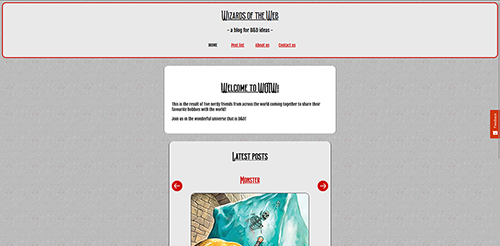

# Wizards of the Web



The purpose of this project is to showcase what I have learned about design, layout, HTML, CSS, JavaScript and API calls.

## Description

Wizards of the Web is a project where the base purpose is to create a blog site by fetching information from an API and print it to a web site as HTML. I chose to have the blog focus on the table top roleplaying game Dungeons & Dragons, dedicating the theme to provide posts includinng ideas and inspiration for characters, stories and combinations that might seem interesting for the reader.

The project description specified to include the following pages:

- Home, displaying a slider/carousel previewing some of the newest posts on the blog.
- Blog post list page, displaying the last 10 posts and allowing the user to load the next 10 (or the rest, if less than 10 is available) posts.
- Blog post details page, displaying the most important content of each blog post as the user chooses from the home page or blog post list.
- About page.
- Contact page containing a form that's validated before it's submitted.

## Built With

I built this website using the following coding languages and APIs:

- HTML
- CSS
- JavaScript
- [WordPress REST API](https://ikpb-mar21pt-cms-ma1.com/wp-json/wp/v2)

## Getting Started

### Installing

This is where you list how to get the project started. It typically just includes telling a person to clone the repo and then to install the dependencies e.g.

1. Clone the repo:

```bash
git clone git@github.com:NoroffFEU/portfolio-1-example.git
```

2. Install the dependencies:

```
npm install
```

### Running

Here is where you detail how to run the app. It typically involves the commands you'd need to run to start the project e.g.

To run the app, run the following commands:

```bash
npm run start
```

## Contributing

Here you can detail any information you want to provide regarding contributing to the project. For big projects you will usually have a separate `CONTRIBUTING.md` and link to it, but for smaller projects you can simply include instructions here. These instructions can simply detail the process you want a person to take, such as to make sure to open a pull request so code can be reviewed.

## Contact

If you need to contact me about anything, you can reach me through the following platforms:

[Discord](https://discord.com/channels/@svevngjengar#4627)

[Instagram](http://instagram.com/prebredev)

[Twitter](https://twitter.com/Ribbon_Blues)

[LinkedIn](http://linkedin.com/in/ida-katrine-presttun-brekken-aa2659206)

## Acknowledgments

I would like to add credit for all visual elements used for either blog post images or icons on the site:

ICONS

- “arrow-circle-left.png”, Arrow icons created by SANB [Flaticon](https://www.flaticon.com/packs/arrow-62)
- “arrow-circle-right.png”, Arrow icons created by SANB [Flaticon](https://www.flaticon.com/packs/arrow-62)
- “arrow-circle-up.png”, Arrow icons created by SANB [Flaticon](https://www.flaticon.com/packs/arrow-62)
- “facebook.png”, Facebook icons created by Freepik [Flaticon](https://www.flaticon.com/packs/social-network-logo-collection)
- “menu-burger.png”, Hamburger icons created by Lizel Arina [Flaticon](https://www.flaticon.com/packs/user-interface-2080)
- “paper-plane.png”, Send icons created by Tanah Basah [Flaticon](https://www.flaticon.com/packs/social-media-ui-11)
- “reddit.png”, Reddit icons created by Freepik [Flaticon](https://www.flaticon.com/packs/social-network-logo-collection)
- “search.png”, Search icons created by Pixel perfect [Flaticon](https://www.flaticon.com/packs/seo-46)
- “twitter.png”, Twitter social badge icons created by riajulislam [Flaticon](https://www.flaticon.com/packs/social-media-343)

IMAGES
Disclaimer: I own no rights to any of these images, and had this been an actual blog, I would have put in more effort to contact the artists and ask for their permission – as well as crediting them properly – before using their images.

- “Aasimar” [Tribality](https://www.tribality.com/2020/01/14/a-guide-to-roleplaying-aasimar/)
- “Adventure Party” [Critacademy](https://www.critacademy.com/post/how-to-run-monster-hordes-in-dungeons-and-dragons)
- “Banshee” [CelticWeddingRings](https://www.celtic-weddingrings.com/celtic-mythology/legend-of-the-banshee)
- “Bugbear Ranger”, user “twobak” [Reddit](https://www.reddit.com/r/3d6/comments/db9c5h/bugbear_ambusher/)
- “D20”, user Taras Dubov [iStock](https://www.istockphoto.com/vector/dice-d20-for-playing-dnd-dungeon-and-dragons-board-game-crossed-swords-of-medieval-gm1422201568-467566950)
- “Dragonborn Fighter” [World Anvil](https://www.worldanvil.com/w/torar-liambic/a/reptilian-heritage-article)
- “Dragonborn Wizard”, user Never_Concedes [Reddit](https://www.reddit.com/r/DnD/comments/9gyfyy/art_rhogar_grrrmmballhyst_dragonborn_wizard/)
- “Eladrin Seasons”, user Marta B.G [ArtStation](https://www.artstation.com/artwork/Leg38R)
- “Halfling Cleric” [WarGamer](https://www.wargamer.com/dnd/halfling-5e)
- “High Elf Mage”, user lekhey [Imgur](https://imgur.com/t/elves/nwENE14)
- “Leprechaun” [Trivia Sharp](https://www.triviasharp.com/st-patricks-day-leprechaun-history-and-facts/)
- “Lizardfolk Druid”, user Ken Ha [ArtStation](https://www.artstation.com/artwork/AqL1Wz)
- “Locked Tower” [TheDNDCoalition](https://www.thedndcoalition.com/dnd-blog/how-to-start-playing-dnd)
- “Monk” [Flutes Loot](https://www.flutesloot.com/monk-multiclass-guide-dnd-5e/)
- “Ooze” [DndBeyond](https://www.dndbeyond.com/posts/949-how-to-play-oozes-like-body-devouring-terrors)
- “Male sitting in studio” by James Barr, used to visualise Dónal Nowell [Unsplash](https://unsplash.com/photos/oRsSeYqJUgY)
- “Just me, being me” by Ian Dooley, used to visualise Hugo Favre [Unsplash](https://unsplash.com/photos/d1UPkiFd04A)
- “Yacht club chic” by Tamara Bellis, used to visualise Eleonóra Martinsen [Unsplash](https://unsplash.com/photos/JoKS3XweV50)
- “Woman in black crewneck shirt” by Marie-Michèle Bouchard, used to visualise Kyla Hardwick [Unsplash](https://unsplash.com/photos/3U9BCWHMhUw)
- “Close-up of guy wearing sunglasses and jacket, with white background” by Edoardo Botez, used to visualise Diederik Blaauw [Unsplash](https://unsplash.com/photos/2msJycbql6w)

I would also like to thank family and friends for their help in acting as my critical users:

- Tobias Presttun-Brekken
- Emil Mathias Valle
- Matias Dale Skjerping
- Michael Brynildsrud Værnor
